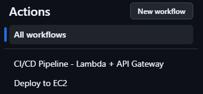
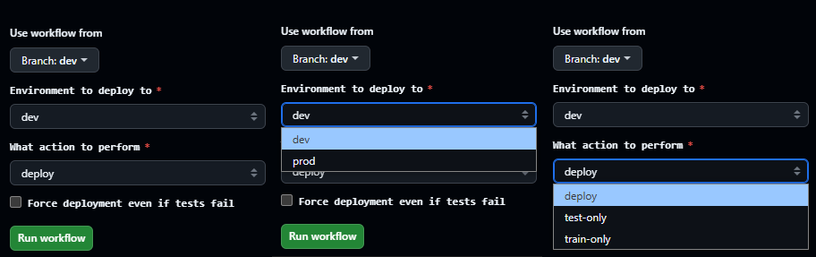
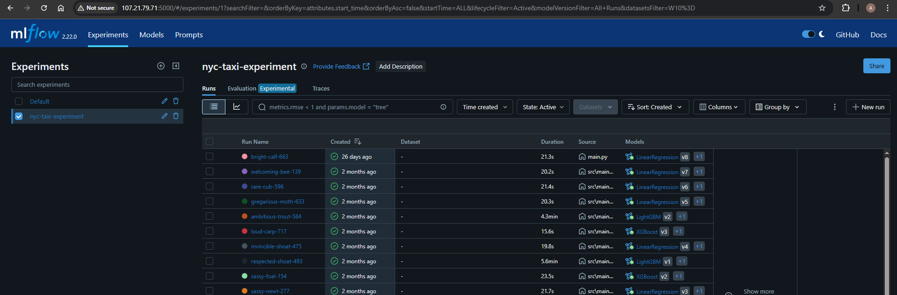

# Taxi Fare Prediction

Short description of the project.

## Project Overview
Brief explanation of what problem this project solves and why it's important.

## Data
Description of the data used, including sources and key characteristics.
Data from [TLC Trip Record](https://www.nyc.gov/site/tlc/about/tlc-trip-record-data.page)

## Model
Overview of the modeling approach and key algorithms used.

## Results
Summary of model performance and key findings.

## Setup and Installation

### Installation

### Clone the Repository
```bash
git clone https://github.com/AhmadHammad21/Taxi-Duration-Prediction.git
cd Taxi-Duration-Prediction
```

### Install UV Package Manager
```bash
# Windows
powershell -ExecutionPolicy ByPass -c "irm https://astral.sh/uv/install.ps1 | iex"

# MacOS and Linux
curl -LsSf https://astral.sh/uv/install.sh | sh

# Create and activate virtual environment
uv init

# Syncing the dependencies to your environment (all packages)
uv sync

# Optional: You can install certain dependencies
# Optional: Install main + dev dependencies (for basic development)
uv sync --extra dev

# Optional: Install main + train dependencies (for ML training work)
uv sync --extra train
```

## Usage

### Run the MLFlow Server
To track machine learning experiments.
```bash
mlflow ui --backend-store-uri sqlite:///mlflow.db
```

### Run Data, Feature, Training Pipeline
```bash
python src/main.py
```

### Development Server
Run the FastAPI server locally for development.
```bash
uvicorn src.app:app --reload --host 0.0.0.0 --port 8000
```

### Deployment Options

#### Option 1: Docker Container (FastAPI Only)
Run just the FastAPI inference server in a container.

```bash
# Build the Docker image
docker build -t taxi-duration-prediction .

# Run the container
docker run -p 8000:8000 taxi-duration-prediction
```

#### Option 2: Full Stack with Docker Compose (Recommended)
Run both MLflow server and FastAPI server together.

```bash
# Build and start the servers
docker-compose up --build -d # in detached mode
# OR 
docker compose up --build 
```

This will start:
- **FastAPI server** at http://localhost:8000
- **MLflow server** at http://localhost:5000

To stop the services:
```bash
docker-compose down
```

### Access the Services

- **FastAPI API Documentation**: http://localhost:8000/docs
- **MLflow UI**: http://localhost:5000 (when using docker-compose)
- **Health Check**: http://localhost:8000/health


## Images

### Deployment Options

This project supports two distinct deployment strategies, each with its own CI/CD pipeline to accommodate different infrastructure needs and use cases.

## Deployment Option 1: EC2 Virtual Machine




## Deployment Option 2: Serverless (AWS Lambda + API Gateway)





### MLflow UI



### FastAPI Server


## Project Structure
Brief explanation of the repository organization.
```
taxi-duration-prediction/
├── src/                     # Source code for all the ML pipelines and services
│ ├── artifacts/             # Models Artifacts
│ ├── config/                # Configurations
│ ├── data_pulling/          # Data download & collection code
│ ├── features/               # Feature engineering pipeline code
│ ├── inference/             # Inference pipeline code
│ ├── training/              # Training service code
│ └── routes/                # API's routes
│ └── schemas/               # Schemas for validation
│ └── utils/                 # Utilities functions and helpers
├── .env.example             # Example environment variables template
├── pyproject.toml           # Project dependencies
```

## To-do List:
- ✅ Structure the project and modules
- ✅ Script to download data
- ✅ Preprocessing & feature engineering
- ✅ MLflow Experiments Tracking, Artifacts, Model Registry, Training Pipeline
- ✅ Inference Pipeline
- ✅ FastAPI API
- ✅ Add Tests (Unit and Integration Tests)
- ✅ Double Check each module and ensure best practices
- [ ] Modify Settings
- ✅ Use loguro for logging
- [ ] Data Version Control (DVC)
- ✅ Add Workflow (CI/CD) GitHub Actions
- ✅ Docker / Docker Compose
- ✅ Deployment Option 1: EC2 Deployment (Traditional VM)
- [ ] Deployment Option 2: AWS Lambda + API Gateway (modify readme.md again)
- [ ] Deployment Option 3: ECs + Fargate
- [ ] Monitoring
- [ ] Grafana / Prometheus
- [ ] Add Kubernetes
- [ ] Add diagram of project flow
- [ ] Move the data and evrything to the cloud


## Time taken to build this project
- 33 Hours

## Contributing
Anyone can contribute.

## License
I don't own the data for the NYC, I'm using it for educational purposes.  
This project is licensed under the MIT License - see the LICENSE file for details.
